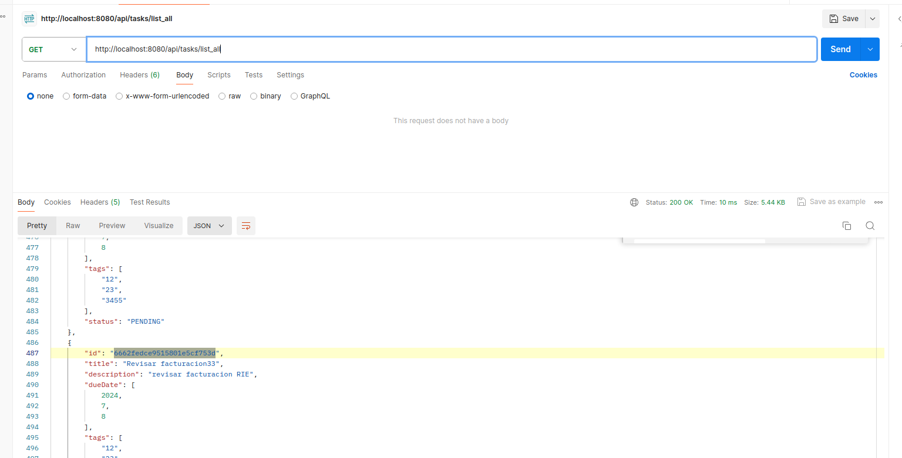
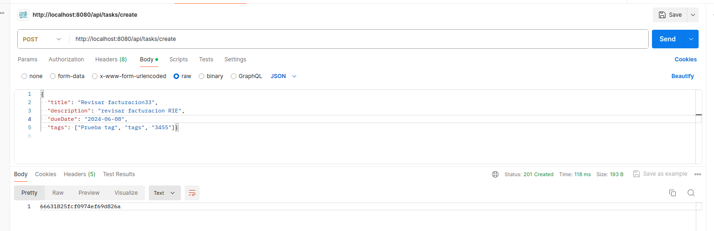

# task-management-test
> Desarrollo de una Aplicación de
Gestión de Tareas
>
## Table of Contents
* [Enunciado](#enunciado)
* [Tecnologías](#tecnologías)
* [Arquitectura](#arquitectura)
* [Estructura de proyecto](#estructura-de-proyecto)
* [Instalacion](#instalacion)
* [Conclusiones](#conclusiones)


## Enunciado
Objetivo:
Desarrollar una aplicación de gestión de tareas utilizando el framework Spring Boot y siguiendo
los principios de la arquitectura hexagonal y el diseño dirigido por el dominio (DDD) La aplicación
debe permitir a los usuarios crear nuevas tareas y ver la lista de tareas existentes.
Requerimientos Funcionales:
1. Creación de Tareas: Los usuarios pueden crear una nueva tarea proporcionando un título, una
   descripción, una fecha de vencimiento y etiquetas opcionales.
2. Listado de Tareas: Los usuarios pueden ver una lista de todas las tareas existentes, incluyendo
   su título, descripción, fecha de vencimiento y estado.
   Requerimientos Técnicos:
- Utilizar Spring Boot para el desarrollo de la aplicación.
- Aplicar los principios de la arquitectura hexagonal.
- Utilizar como base de datos MongoDB.
  Entregables:
- Código fuente de la aplicación.
- Documentación técnica que explique cómo configurar y ejecutar la aplicación.
  Consideraciones Adicionales:
1. Se valorará la claridad, la organización y la estructura del código, así como la adhesión a los
   principios de la arquitectura hexagonal y DDD.
2. Se recomienda seguir las mejores prácticas de desarrollo de software y utilizar patrones de
   diseño adecuados para cada capa de la aplicación.
3. El tiempo estimado para completar el desarrollo de la aplicación es de 4/5 horas. Se espera un
   enfoque ágil y eficiente para cumplir con los objetivos planteados.

## Tecnologías
- Java 17
- Maven
- Git
- Spring Boot
- BBDD mongodb
- Spring data
- Lombok
- Modelmapper (Tambien se podría utilizar mapstruct)
_
_
## Arquitectura

En este proyecto hemos utilizado una arquitectura hexagonal, también conocida como "Puertos y Adaptadores", por las siguientes razones:

#### Separación de Responsabilidades
- Claridad en la separación entre la lógica de negocio y los detalles de implementación.
- Facilita el mantenimiento y la evolución del código al evitar dependencias directas.

#### Flexibilidad y Adaptabilidad
- Permite cambios en los detalles de implementación sin afectar la lógica de negocio.
- Facilita la adaptación a nuevas tecnologías o entornos sin un gran impacto en el código existente.

#### Pruebas Unitarias Aisladamente
- Aísla la lógica de negocio de los detalles de implementación, facilitando pruebas más enfocadas y menos propensas a errores.

#### Reutilización de Componentes
- La capa de dominio independiente fomenta la reutilización de componentes.
- Facilita la incorporación de nuevas características sin afectar las existentes.

#### Mejora de la Mantenibilidad
- Estructura clara y modular para facilitar la identificación y corrección de problemas.
- Mejora la capacidad para incorporar nuevas funcionalidades.

#### Adopción de Principios SOLID
- Sigue los principios SOLID, promoviendo prácticas de desarrollo sólidas.
- Mejora la calidad del diseño del software y la capacidad para enfrentar cambios en los requisitos.

Esta elección proporciona una base sólida para el desarrollo y mantenimiento eficiente del proyecto.


## Estructura de proyecto

- **config/**: Directorio que contiene configuraciones adicionales para la aplicación.

- **docker-compose.yml**: Archivo de configuración para definir servicios, redes y volúmenes en Docker.

- **Dockerfile**: Archivo de configuración para construir una imagen de Docker para la aplicación.

- **mvnw**: Script de Maven Wrapper para construir y ejecutar la aplicación sin necesidad de tener Maven instalado globalmente.

- **mvnw.cmd**: Script de Maven Wrapper para Windows.

- **pom.xml**: Archivo POM (Project Object Model) de Maven que define la configuración del proyecto y las dependencias.

- **README.md**: Archivo de documentación principal del proyecto.

Contiene el código fuente de la aplicación.

  - **java/**: Directorio que contiene el código fuente de Java.
    - **com/rizquierdo/test/taskmanagement/**: Paquete raíz de la aplicación.
      - **application/**: Contiene clases relacionadas con la lógica de la aplicación.
        - **service/**: Contiene implementaciones de servicios.
          - **TaskCreateServiceImpl.java**: Implementación del servicio de creación de tareas.
          - **TaskQueryServiceImpl.java**: Implementación del servicio de consultas de tareas.
        - **usercases/**: Contiene interfaces de casos de uso.
          - **TaskCreateService.java**: Interfaz para el servicio de creación de tareas.
          - **TaskQueryService.java**: Interfaz para el servicio de consultas de tareas.

      - **domain/model/**: Contiene clases de modelo de dominio.
        - **Task.java**: Clase que representa una tarea.
        - **TaskStatus.java**: Enumeración que define los posibles estados de una tarea.
      - **infraestructure/**: Contiene clases de infraestructura.
        - **config/**: Contiene configuraciones de la aplicación.
          - **JacksonConfiguration.java**: Configuración de Jackson para la serialización/deserialización de objetos.
        - **mapper/**: Contiene configuraciones para mapeo de objetos.
          - **ModelMapperConfig.java**: Configuración de ModelMapper.
        - **persistence/**: Contiene clases relacionadas con la persistencia de datos.
          - **entity/**: Contiene entidades JPA.
            - **TaskEntity.java**: Entidad que representa una tarea en la base de datos.
          - **repository/**: Contiene interfaces de repositorio.
            - **TaskMongoRepository.java**: Interfaz de repositorio para la entidad TaskEntity.
        - **rest/**: Contiene clases relacionadas con la capa de presentación REST.
          - **advice/**: Contiene clases para manejo de excepciones.
            - **GlobalExceptionHandler.java**: Clase para manejar excepciones globales.
          - **controller/**: Contiene controladores REST.
            - **TaskCreationController.java**: Controlador para la creación de tareas.
            - **TaskQueryController.java**: Controlador para listado de tareas.
          - **dto/**: Contiene DTOs (Data Transfer Objects) para la capa REST.
            - **CreateTaskDTO.java**: DTO para la creación de tareas.
            - **TaskDTO.java**: DTO para listado de tareas.
            - **ErrorDto.java**: DTO para representar errores.
      - **TaskmanagementApplication.java**: Clase principal que inicia la aplicación.

  - **resources/**: Contiene recursos de la aplicación.
    - **application.yaml**: Archivo de configuración YAML para la aplicación.


## Instalacion

El proyecto esta dockerizado por lo que habrá que tener instalado docker y docker-compose.

Y para montar todo el proyecto y desplegarlo habrá que ejecutar lo siguiente:
sudo docker-compose up


Un ejemplo de request GET sería http://localhost:8080/api/tasks/list_all a traves del navegador o postman.


Y para crear una tarea aqui tenemos un ejemplo al crearse devolverá el id de la tarea:



O con curl

```bash
curl -X POST http://localhost:8080/api/tasks/create \
-H "Content-Type: application/json" \
-d '{
  "title": "Revisar facturacion33",
  "description": "revisar facturacion RIE",
  "dueDate": "2024-06-08",
  "tags": ["Prueba tag", "tags", "3455"]
}'
```


## Conclusiones
Este ejercicio consistió en la implementación de un sistema básico de gestión de tareas utilizando una arquitectura hexagonal combinada con Domain-Driven Design (DDD). En esta ocasión, los casos de uso eran lo suficientemente simples como para no requerir la utilización del dominio Task. En su lugar, opté por exponer directamente objetos de transferencia de datos (DTOs) en los endpoints REST.

Si la complejidad de la lógica de negocio aumentara en el futuro, la introducción de los dominios, como Task, sería la siguiente etapa lógica. Esto permitiría una mayor encapsulación y cohesión de la lógica empresarial en objetos de dominio bien definidos.

Este enfoque de diseño modular y escalable nos permite adaptarnos fácilmente a los cambios y expansiones futuras, manteniendo un código limpio y fácil de mantener en todo momento.

Se podrían ir añadiendo mas cosas por ejemplo test , documentacion con open api etc.
## Contact
Created by rizquierdo.
